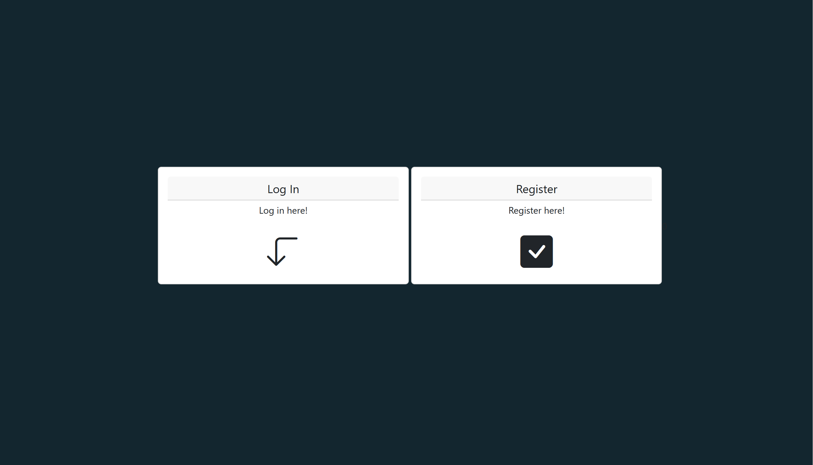
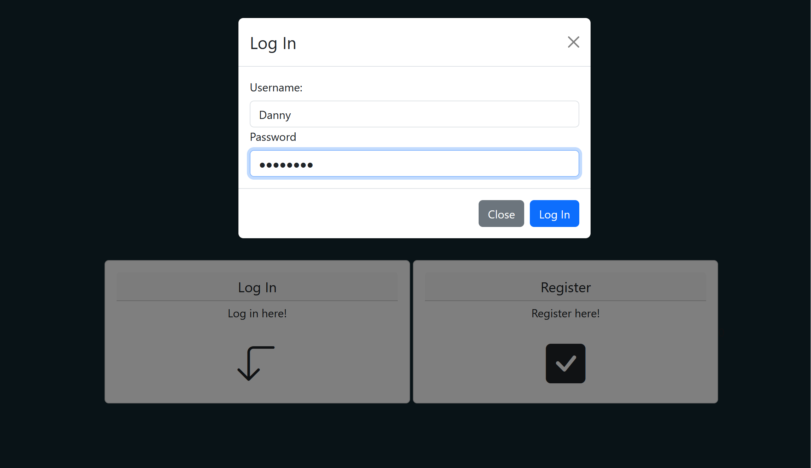
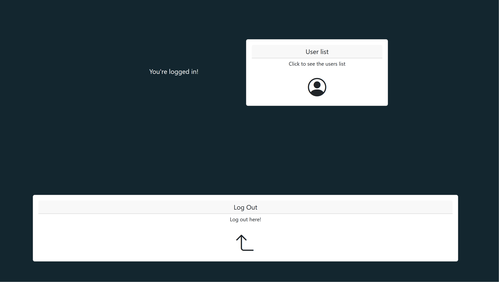
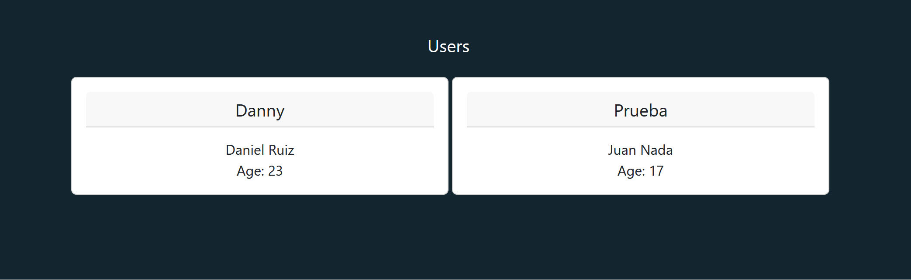
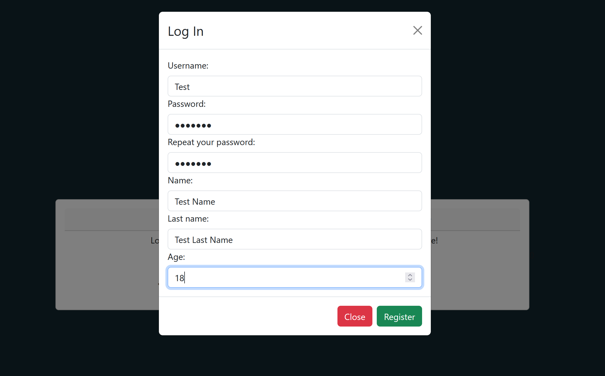

# Log In with React and Vite

This project was created just to test log in using [JSON Web Token](https://jwt.io/) and Flask as a backend framework. The backend is also on my [GitHub](https://github.com/DannyB935/API-Users)/[GitLab profile]().

Instalation
-----------

Run the next command to install all the packages:
```
npm install
```

After the instalation, you just need to run the server, the webpage will open on the port 5173

```
npm run dev
```

User guide
----------

Just going into the landing page you will see only buttons to log in or register.



The steps to log in are pretty much the same to log in into any other website.



If you're and admin, you can see an extra button to see the users list in the database





If you're a common user you can only see the log out button

For register a new user the steps are the same for log in, once all the fields are filled you will get logged in automatically.

